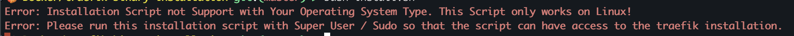
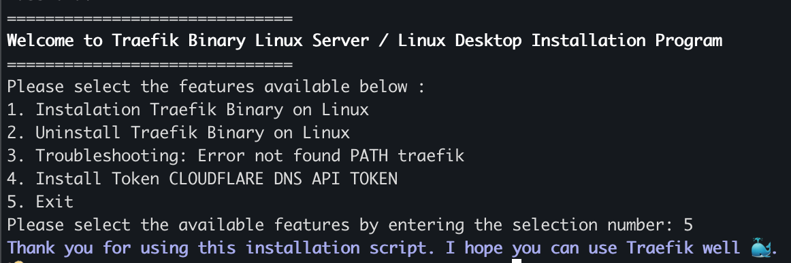

# Traefik Reverse Proxy Binary Installation with Shell Script

We start from the introduction of the project. This project is a simple project with the main purpose of automating the installation of the Traefik Reverse Proxy Binary to the Linux operating system, and is highly recommended for use on Linux servers such as Ubuntu and CentOs. This Automation Script is created using the Bash Shell but if you do not prefer when using bash you can use the Z Shell or POSIX Shell to execute this script. As configuration support we have customized the binary according to your Linux Architecture and some additional features such as FAQ and Cloudflare Token API Installation.

Before getting into the Installation and usage guide it is better to understand what should be set up in your Linux server before running the script installation

## Requirements Tools

In the installation script, there are several tools that must be available to support the action operations in the installation script such as Download Files or Extract file tools which will be listed below:

- **Unix Shell (Bash, POSIX, Z Shell)** : Unix Shell has the task of executing a collection of bash commands that have been created to interact with scripts.
- **Wget (Unix Package)** : Wget has a function to download Traefik Binary files to Linux Server.
- **Tar (Unix Package)** : Tar Package has a function to extract the Traefik Binary Package which is still in the form of .tar.gz which we can take the binary to move to the file system.

After you make sure the above tools are available, let's move on to understand what the limitations of this Traefik Installation Automation Script are.

## Script Installation Limitations

In this project, it is still only developed by one person so there are still limitations in this installation script, the following are some conditions that must be considered so that the script can run properly:

> [!WARNING]
> Please be aware of these limitations and make sure your Linux Server does not violate them so as not to cause errors.

Here are the limitations of the installation script:

1. The Installation Script only runs on Linux Operating System / Linux Server (Highly recommended Linux based on Debian derivatives such as Ubuntu).
2. This Installation Script can run on Desktop-based Linux but must still be Linux and Unix based (Does not run on Mac Os even though it is based on Unix Operating System).
3. The Installation Script only runs well on Linux with amd64 (x86_64) and arm64 (aarch64) Architecture. However, the installation script can still work on other architectures if Traefik provides a binary for your Linux architecture.
4. It is highly recommended to use Bash Shell even though the shell script can support Z Shell or POSIX Shell still bash is the main option to run this script.

Once you understand the Limitations of the Installation Script then you can proceed to the understanding installation phase below.

## Prerequisites

Before running the installation it would be good to understand what you can change or customize regarding the Traefik files contained in the `traefik_config` folder which contains the `traefik.yml` file containing the static Traefik configuration and `dynamic.yml` which is for routing, middleware implementation and service declarations for the reverse proxy.

Here is a file that you can modify to suit your server needs:

1. `traefik.yml`

```yaml
# Entrypoint For Request Handler From Port 80 and 443
entryPoints:
  # Http Request Handler
  web-http:
    address: ":80"

# Dashboard Traefik (Add Comment this section if you not needed Traefik Dashboard API)
api:
  dashboard: true
  insecure: true

# Logging
log:
  level: DEBUG
  filePath: /var/log/traefik/traefik-general-log
  format: common

accessLog:
  filePath: /var/log/traefik/traefik-access-log
  format: common

# Read Routing, Service and Middleware From File in `/etc/traefik/dynamic.yml`
providers:
  # Read Configuration Routing from File
  file:
    filename: /etc/traefik/dynamic.yml
    watch: true
```

2. `dynamic.yml`

```yaml
http:
  routers:
    default-http-router:
      entryPoints:
        - web-http
      rule: "PathPrefix(`/`)"
      service: api@internal
```

> [!WARNING]
> Make sure if you want to change the systemd traefik `traefik.service` file that you understand what you are writing, deleting and the risks involved.

Make sure you understand the file to proceed with the installation. If you need a traefik guide you can view the official traefik documentation at the following [link](https://doc.traefik.io/traefik/)

## Installation Steps

Finally we enter these steps. Let's get into the installation phase with a few very easy and quick steps. I hope you can easily follow the guide below:

1. Clone Repository Project

```bash
git clone https://github.com/HaikalRFadhilahh/traefik-binary-linux-installation-script.git traefik-installation-script
```

2. Change Directory to Project Folder

```bash
cd traefik-installation-script
```

3. Running Installation Script

```bash
sudo bash install.sh
```

> [!WARNING]
> Make sure you run the installation script with Super User / Sudo Access to be able to configure the System Folder.

If you do not run with sudo you will receive an error like this below and repeat the command with sudo access!



If you don't experience any errors and have followed all of the above guidelines you will have a display like this and you only need to have a menu to be able to install, uninstall, FAQ Errors and Install Cloudflare Tokens.



Congratulations you can use my Intalasi Script haha. And here is the additional Port Mapping information if you don't change the `traefik.yml` configuration

| EntryPoints / Port Acess |                 Router                  | Service      |
| :----------------------: | :-------------------------------------: | ------------ |
|        0.0.0.0:80        | default-http-router with PathPrefix(`/`) | api@internal |

At this point you have successfully installed Traefik Reverse Proxy with the Bash Shell and you can do further configuration in the `/etc/traefik/dynamic.yml` and `/etc/traefik/traefik.yml` files. You can read the references below for further guidance.

## References

- Traefik Reverse Proxy Official Documentation you can access the [following link](http://doc.traefik.io/traefik)
- Implementing Traefik Reverse Proxy and Jenkins with Docker and Docker Compose you can access the [following link](https://github.com/HaikalRFadhilahh/jenkins-docker-with-traefik-re)
- Officical Repository of Traefik Reverse Proxy Project you can access with [following link](https://github.com/traefik/traefik/)

## Contributors

You can contribute to this project through Pull Requests to this Repository, or you can report bugs or vulnerabilities through the issues feature on github. 🐳

## License

Free for personal and commercial use. You may modify and distribute it without restriction.

<hr>

<p align="center">Created By Haikal and Contributors with ❤️</p>
